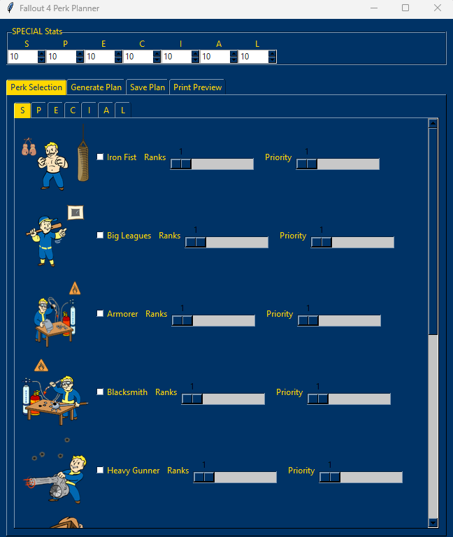

# Fallout 4 Perk Planner (FPP)
*A community-made perk planning tool celebrating the 10th Anniversary of Fallout 4.*



---

## 📖 Overview
The **Fallout 4 Perk Planner (FPP)** is a Python-based desktop application that lets players design and visualize their custom perk progression from Level 2 to 50 — and beyond.  
It uses a **Tkinter GUI** to load perk data from a JSON file (`perks_flattened_full.json`) and allows users to generate, save, and preview personalized perk plans.

This project was developed to commemorate **10 years of Fallout 4** (2015 – 2025) and to give fans a nostalgic yet modern way to strategize their builds.

---

## ⚙️ Requirements

### System
- **Python 3.10+**
- OS: Windows, Linux, or macOS

### Dependencies
Install required modules:
```bash
pip install pillow
```
> (Tkinter and json are built into Python.)

---

## 🚀 How to Use

1. **Extract the ZIP file**  
   Unpack `FPP.zip` into a directory of your choice.

2. **Run the Program**
   ```bash
   python3 Fallout_Perk_Planner.py
   ```

3. **Load Perk Data**
   - Ensure the file `perks_flattened_full.json` is in the same directory.  
   - The program will automatically read and display all available perks.

4. **Build Your Plan**
   - Select perks and ranks per level.
   - Preview your build in the print preview window.
   - Save your completed plan as a text file.

5. **Enjoy and Share**
   - Compare builds, optimize playthroughs, and celebrate Fallout 4’s legacy!

---

## 🧩 Files in This Project
| File | Description |
|------|--------------|
| `Fallout_Perk_Planner.py` | Main GUI application |
| `perks_flattened_full.json` | Flattened dataset of all Fallout 4 perks |
| `perk_images/` | Folder containing perk icons |
| `image.png` | Project banner image |
| `README.md` | This file |

---

## 🏆 Anniversary Note
This project was made with appreciation for **Bethesda Game Studios** and the **Fallout community**, celebrating the **10th Anniversary of Fallout 4**.  
It is **not affiliated with or endorsed by Bethesda** — just made by fans, for fans.

---

## 👤 Author
**Jerrin C. Redmon**  


---

## 📜 License
This project is licensed under the **GNU General Public License v3.0 (GPL-3.0)**.  
You may freely use, modify, and distribute this program as long as derivative works remain under the same license.  
See the [LICENSE](https://www.gnu.org/licenses/gpl-3.0.html) file or visit [gnu.org/licenses/gpl-3.0](https://www.gnu.org/licenses/gpl-3.0.html) for details.

---
